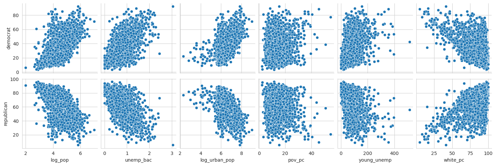
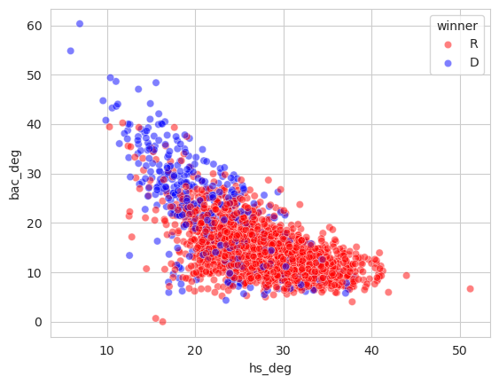
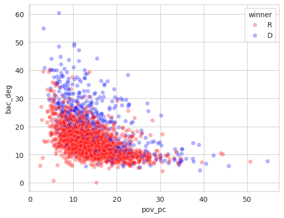
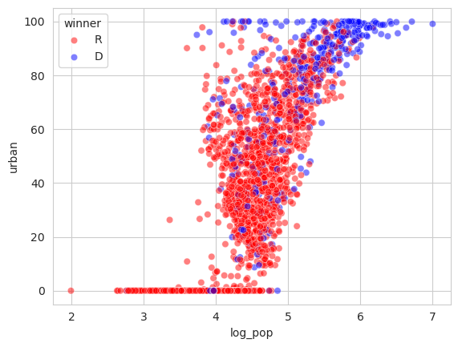
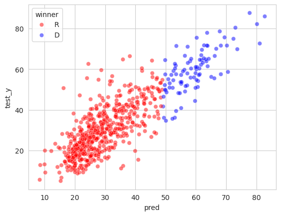

# How People Vote
## A look into how socioeconomic factors affect voting patterns
### (project for Datascience Bootcamp, Erdos Institute, Summer 2024)

Group Members: Srijan Ghosh, Li Meng, Giovanni Passeri, Alicia Xiao

## Overview
We take a look at how various socioeconomic factors affect voting patterns across the US by considering a county level breakdown of the 2020 US presidential election.

## Libraries
The following python libraries are needed to run the programs in this project:

    - numpy
    - pandas
    - sklearn
    - keras
    - tensorflow
 
## Dataset
The following are some of the key datasets used in our project (taken from the US census database):
    Demographics {population, race and ethnicity, sex and gender, age groups}
    Poverty
    Education
    Employment
    Income
    Urban/Rural Population
    
We use the data from the American Community Survey 5-Year Data. These cover all the US counties. There is also a ACS 1-Year database covering fewer counties (>= 65000 people) but with more recent data.
There is an aggregate file (aggregate.csv) that has a few of the features we found interesting based on initial data exploration.

    
Click here to see the features in aggregate.csv

    
        * GEO_ID: Unique identifier attached to each county
        * NAME: Name of the county
        * total_pop: Total population of the county
        * pop_18_30_pc: Percentage of people in the age range 18 to 30
        * pop_60_up_pc: Percentage of people in the age range 60 and up
        * pop_male_pc: Percentage of male population
        * afr_amer_pc: Percentage of african american population
        * amer_ind_pc: Percentage of american indian population
        * asian_pc: Percentage of asian population
        * latino_pc: Percentage of latino population
        * white_pc: Percentage of white population
        * _delta: Change in percentage of * population from 2016 to 2019
        * pov_pc: Percentage of people below the poverty limit
        * pov_pc_delta: Change in pov_pc
        * unemp_rate: Unemployment rate as a percentage of population
        * unemp_delta: Change in unemployment rate from 2016 to 2019
        * mean_hhi: Mean household income
        * med_hhi: Median household income
        * urban: Percentage of people in urban area
        * rural: Percentage of people in rural area
        * hs_deg: Percentage of the adult population with a high school or equivalent degree
        * bac_deg: Percentage of the adult population with a bachelors degree
        * democrat: Percentage of votes going to the democratic candidate
        * republican: Percentage of votes going to the republican candidate

For election results we use county level election data from MIT Election Lab (https://electionlab.mit.edu/data)

## Objective
We model the outcome of the election as well as the percentage of votes gained by the democratic candidate (this is roughly equal to 100 - the percentage of votes gained by the republican candidate).

## Data Exploration
After sanitising the data, we found interesting correlations between the following variables and the votes gained by the democratic candidate:

   - log_pop: Logarithm (base 10) of the total population.
   - white_pc: People living in the county belonging to ethnicity white (this is highly correlated to people of other ethnicities, hence we only consider white_pc as a feature).
   - urban: People living in urban areas (equal to 100 - people living in rural areas)
   - log_urban_pop: Logarithm of the total urban population
   - unemp_rate: Unemployment rate in the county
   - bac_deg: Percentage of adults holding a bachelor degree or higher
   - hs_deg: Percentage of adults holding with a high school degree as highest educational attainment
   - pop_18_30_pc: Percentage of young people (18 to 30 years of age)
   - pop_60_up_pc: Percentage of older people (60 years or older)
   - pov_pc: Percentage of people living under the poverty limit
   - unemp_bac: Product of unemp_rate and bac_deg

Here are some related plots:

## Modeling
We use the above mentioned variables as our features and consider both regression and classification problems.

### Regression (predicting the percentage of votes):

A 5-fold cross-validation is used for all the models below:

    - Baseline: Simply predict the average voter percentage for every sample.
    - Linear Regression: We iterate over the powerset of the features to find the best subset for linear regression. (code in ./lin_regression.ipynb)
    - Random Forest Regressor: With 500 trees and bootstrapping. (code in ./random_forests.ipynb)
    - XGBoost: We use GridSearchCV to do hyperparameter tuning for n_estimators, max_depth and learning_rate. (code in ./xgboost.ipynb)
    - Neural Network: We use a feed forward neural network with two hidden layers of size 15 each. (code in ./neural_network.ipynb)

The following table has our accuracy results on the validation data:

| Model         | RMSE          |  R^2  |
| ------------- |:-------------:| -----:|
| Baseline      | 15.96         |      0|
| LinearReg     | 9.19          |   0.50|
| RandomForest  | 9.15          |   0.33|
| XGBoost       | 8.21          |   0.63|
| NeuralNetwork | 8.27          |   0.63|

Based on the above we chose XGBoost as our desired model. Final training and testing on the initially split dataset yield the following:

| Model         | RMSE         | R^2  |
| ------------- |:------------:|-----:|
| XGBoost       | 8.35         |  0.63|

### Classification (predicting the winner in the county):

A 5-fold cross-validation is used for all the models below (code in ./classifiers.ipynb):

    - Baseline: Predicting the winner as a binomial distribution with probability = (sample counties where democrat vote is higher)/(total number of sample counties)
    - Logistic Regression: Predicting the winner with threshold set at 0.4, 0.5 and 0.6. The accuracy is highest with 0.5
    - Random Forest Classifier: Use GridSearchCV to find optimal hyperparameters for n_estimators and max_depth
    - SVC: Use GridSearchCV to find optimal hyperparameters for C and kernel

We get the following results on validation data:

| Model         | Accuracy Score|
| ------------- |:-------------:|
| Baseline      | 0.7127        |
| LogisticReg   | 0.9061        |   
| RandomForest  | 0.9226        |
| SVC           | 0.9266        |

Based on this, we chose SVC as our classifier of choice. After final training and testing, we get the following:

| Model         | Accuracy Score|
| ------------- |:-------------:|
| SVC           | 0.9197        |